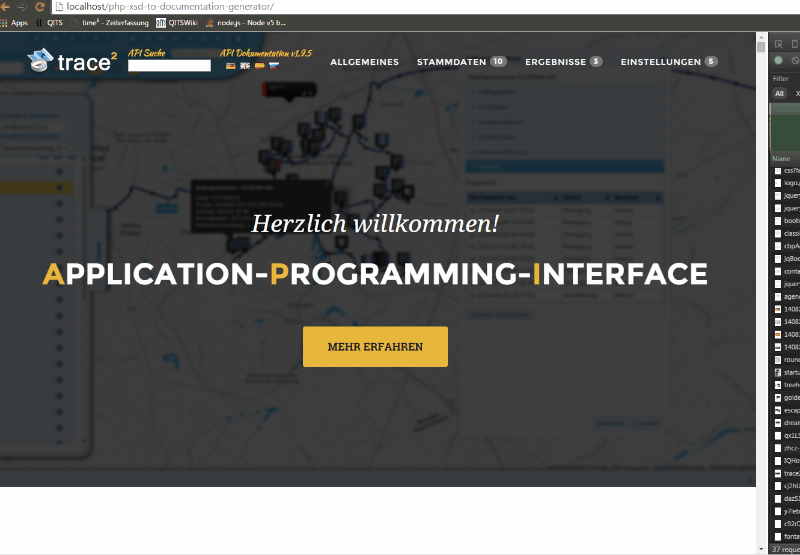

# Dynamic generate a responsive documentation by using XSD webservice description files

# Features
 - Use and generate a documentation "on the fly"
 - Multilang
 - Responsive
 - Easy to customize
 - Searchable, and structured
 - Including one example Theme (see gif)
 
 
# Live Example to commited Test XSD Files

 
# How to
 - Clone Repo
 - place in your XSD files
 - check gui.load.php and insert your configurations
 
# XSD Example to decribe your application interfaces
```
<?xml version="1.0" encoding="utf-8" ?>
<xs:schema xmlns:xs="http://www.w3.org/2001/XMLSchema">

<xs:element name="fnDrivers">
<xs:annotation>
<xs:documentation xml:lang="de">Klasse benötigt für die Fahrer.
</xs:documentation>
<xs:documentation xml:lang="en">Class used for Drivers
</xs:documentation>
</xs:annotation>
	<xs:complexType>
    	<xs:all>
    		<xs:element name="load">
    		<xs:annotation>
  			<xs:documentation xml:lang="de">Laden von Fahrern.
			</xs:documentation>
			<xs:documentation xml:lang="en">load of Drivers
			</xs:documentation>
			</xs:annotation>
			 <xs:complexType>
			 	<xs:all>
			 		<xs:element name="userID" minOccurs="1" type="xs:integer">
			   		<xs:annotation>
			   		<xs:documentation xml:lang="de">ID des spaau href="#fnsimpleuser_insert">Benutzers(Fahrer) spazu aus der Datenbank z.B. 1.
			   		</xs:documentation>
			   		<xs:documentation xml:lang="en">ID of the spaau href="#fnsimpleuser_insert">User(Driver) spazu from the database for example 1.
			   		</xs:documentation>
			   		</xs:annotation>
					</xs:element>
			 	</xs:all>
			 </xs:complexType>
    		</xs:element>
    		<xs:element name="delete">
    		<xs:annotation>
  			<xs:documentation xml:lang="de">löschen von Fahrer.
			</xs:documentation>
			<xs:documentation xml:lang="en">delete of Drivers
			</xs:documentation>
			</xs:annotation>
    		</xs:element>
    		<xs:element name="update">
    		<xs:annotation>
  			<xs:documentation xml:lang="de">Aktualisieren von Fahrer.
			</xs:documentation>
			<xs:documentation xml:lang="en">update of Drivers
			</xs:documentation>
			</xs:annotation>
    		</xs:element>
    		<xs:element name="insert">
    		<xs:annotation>
  			<xs:documentation xml:lang="de">Einfügen von Fahrern.
			</xs:documentation>
			<xs:documentation xml:lang="en">insert of Drivers
			</xs:documentation>
			</xs:annotation>
    		</xs:element>
    	</xs:all>
	</xs:complexType>
</xs:element>

</xs:schema>
```

# XSD parser for example file (used in gui.load.php)
```
 $generator=new APIProcessor("img/logo.png","lang/","xsd/");
                $generator->apiVersion="1.9.0";
                $generator->keywords=array("json"
                                            ,"xml"
                                            ,"true"
                                            ,"format"
                                            ,"parse json"
                                            ,"yes");
                $generator->links=array("skey"=>"http://example.de"
                                        ,"token"=>"http://example.de"
                                        ,"API Call"=>"http://example.de"
                                        ,"format"=>"http://example.de"
                                        ,"lang"=>"http://example.de#lang"
                                        ,"NEW_ORDERS_DELIVERY_PUFFER"=>"http://example.de#generaltrace2Parameter");
//                $generator->replaceIcon=array("##warn##"=>"http://example.de/ico.png");
//                $generator->highlight=array("muss");
                $page=$dom["theme1"]["page"];
                
//                //Baue Head  
//                $code="";
//                $menuitem=$dom["theme1"]["group_navi_elem"];
//                foreach($this->groups as $key=>$elem) {
//                    $code.=str_replace(array("##GROUPID##","##GROUPNAME##"),array($key,""),$menuitem); 
//                }
//                
//                $dom=str_replace('##GROUPNAVI##', $code, $page);	
//                
//                STAMMDATENFUNCTIONS
                $this->groups["##STAMMDATEN##"]=array("class.fnDrivers"
                                                ,"class.fnAuftraege"
                                                ,"class.fnAupos"
                                                ,"class.fnUpos"
                                                ,"class.fnCustomer"
                                                ,"class.fnTour"
                                                ,"class.fnDrawings"
                                                ,"class.fnServiceHinweise"
                                                ,"class.fnServiceRythm"
                                                ,"class.fnCat"
                                                );
                $this->groups["##ERGEBNISSE##"]=array("class.fnFleetPositions"
                                                        ,"class.fnFleetEvents"
                                                        ,"class.fnFleetTourActivity"
                                                        );
                $this->groups["##EINSTELLUNGEN##"]=array("class.fnTourAssignments"
                                                            ,"class.fnDriver2Tour"
                                                            ,"class.fnAndroidConfiguration"
                                                            ,"class.fnCustomTour"
                                                            ,"class.fnImports"
                                                            );
                $systemURL="https://be.trace2.de/trace2/service.php";
                $systemName="trace2";
                $systemDefaultParams="&format=json";
                $xsdArray=$generator->getResults();
```
ToDo:
 - Backend is coded in PHP but the framework is not open source (so we need a new backend)
 - structured milestones and task group definitions
 - exclude the project definitions out of gui.load.php to a project config file
 - get a filehoster for this project to provide a better demo
 
